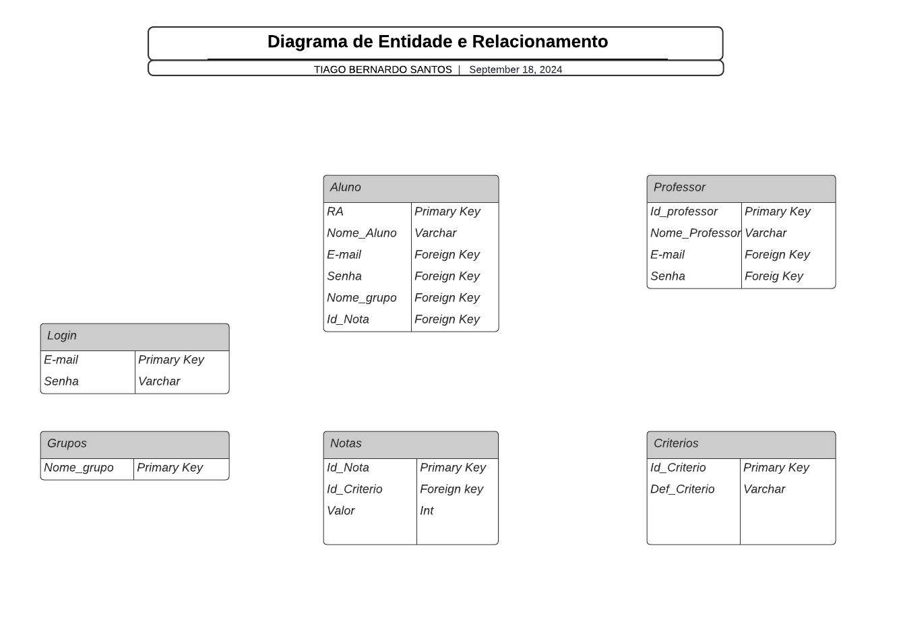

# 🚀 API 2º Semestre - 2024/2

🎓 **Parceiro Acadêmico:** FATEC São José dos Campos - Prof. Jessen Vidal

🔗 **Repositório:** [DenariusData/API-2SEM](https://github.com/DenariusData/API-2SEM)

---

## 📌 Resumo do Projeto

> **PACER+** — sistema automatizado de avaliação de competências para a metodologia de Aprendizagem por Projetos Integrados, substituindo o processo manual de avaliação (sujeito a erros e a retrabalho por parte dos professores).

---

## ⚠️ Problema

> Ao final de cada sprint, os professores precisam coletar e consolidar as avaliações de competências (PACER) preenchidas manualmente pelos alunos, gerando planilhas dispersas, cálculo manual de médias e alto consumo de tempo administrativo.

---

## 💡 Solução

> Desenvolvimento de uma aplicação desktop em Java com JavaFX que digitaliza todo o fluxo de avaliação: autenticação por perfil (aluno/professor), importação de grupos, calendário de sprints, gerenciamento de critérios de avaliação, cálculo automático das médias e geração de relatórios em CSV — tanto individuais quanto por grupo.

**Funcionalidades:**
- Avaliação online de membros da equipe ao final de cada sprint
- Geração de relatórios individuais e por grupo (exportação CSV)
- Importação de grupos via arquivo, gerenciamento de critérios de avaliação
- Calendário de sprints com associação automática por data
- Autenticação por usuário e senha para alunos e professores

---

## 🛠 Tecnologias Adotadas

**Java | JavaFX | Scene Builder | MySQL | Jira | Slack | VS Code**

- **Java**: linguagem principal do backend e da lógica de negócios da aplicação desktop.
- **JavaFX / Scene Builder**: construção da interface gráfica desktop do sistema.
- **MySQL**: armazenamento de todas as informações do sistema (usuários, grupos, sprints, critérios e notas).
- **Jira**: gestão de sprints e rastreamento de tarefas do time.
- **Slack**: comunicação diária entre os membros do grupo.
- **VS Code**: apoio na edição de arquivos de configuração e documentação do projeto.

---

## 👨‍💻 Contribuições Individuais

Atuei como **Dev Team**, participando principalmente das frentes de modelagem de banco de dados e desenvolvimento de interface. Abaixo estão as entregas, com o modelo e o código correspondentes e o link de cada commit.

### 🗂️ 1. Modelagem do Banco de Dados

Elaborei a primeira versão do Diagrama Entidade-Relacionamento (DER) do sistema, levantando as entidades do fluxo de avaliação (aluno, professor, grupos, critérios e notas). Esse diagrama foi o ponto de partida da discussão de modelagem do time, que evoluiu o modelo ao longo das sprints até o script final em MySQL.

🔗 Commit: [`9002e39` — SCRUM-54 | Diagrama ER de banco de dados](https://github.com/DenariusData/API-2SEM/commit/9002e3993724fbeec825fb2ffc654ec52e45125d)

<details>
<summary><b>Modelo — primeira versão do DER que elaborei</b></summary>
<br>



</details>

<details>
<summary><b>Como o modelo evoluiu — trecho do script final do time (script.sql)</b></summary>

A versão final manteve as entidades levantadas no DER e acrescentou a tabela de sprints e a avaliação entre pares (quem avalia e quem é avaliado), com as chaves estrangeiras garantindo a integridade.

```sql
CREATE TABLE CRITERIOS (
    CRITERIO_ID INT AUTO_INCREMENT,
    CRITERIO_NOME VARCHAR(50) NOT NULL,
    CRITERIO_DESCRICAO VARCHAR(600),
    CRITERIO_ATIVO BOOLEAN DEFAULT TRUE,
    PRIMARY KEY (CRITERIO_ID)
);

CREATE TABLE AVALIACAO (
    AVALIACAO_ID INT AUTO_INCREMENT,
    AVALIADO_ALUNO_RA BIGINT NOT NULL,
    AVALIADOR_ALUNO_RA BIGINT NOT NULL,
    CRITERIO_ID INT NOT NULL,
    NOTA DECIMAL(3,1) NOT NULL,
    SPRINT_ID INT NOT NULL,
    PRIMARY KEY (AVALIACAO_ID),
    FOREIGN KEY (AVALIADO_ALUNO_RA) REFERENCES ALUNO(ALUNO_RA),
    FOREIGN KEY (AVALIADOR_ALUNO_RA) REFERENCES ALUNO(ALUNO_RA),
    FOREIGN KEY (CRITERIO_ID) REFERENCES CRITERIOS(CRITERIO_ID),
    FOREIGN KEY (SPRINT_ID) REFERENCES SPRINT(SPRINT_ID)
);
```

📎 Script completo: [script.sql](https://github.com/DenariusData/API-2SEM/blob/main/Pacer/src/main/resources/db/script.sql)

</details>

### 🖥️ 2. Tela inicial do aluno — JavaFX

Contribuí com o desenvolvimento da tela inicial do perfil de aluno em JavaFX/Scene Builder. A tela traz um calendário do mês montado dinamicamente, que destaca o dia atual e o período de avaliação da sprint, e o botão para o aluno realizar a avaliação. Também fiz ajustes de layout no FXML da tela.

🔗 Commits: [`69013c0` — SCRUM 64 | Tela inicial do aluno](https://github.com/DenariusData/API-2SEM/commit/69013c0ca4a006828d7b74b5cc99d6ce77c529b9) · [`057fc94` — ajustes de layout no AlunoHomeView.fxml](https://github.com/DenariusData/API-2SEM/commit/057fc94015e1293aaf5ce91bd530c6ecfa240957)

<details>
<summary><b>Código em Java — calendário da tela inicial do aluno (AlunoHomeController.java)</b></summary>

```java
// Preenche o calendário com os dias do mês
private void populateCalendar(YearMonth yearMonth) {
    LocalDate firstOfMonth = yearMonth.atDay(1);
    int daysInMonth = yearMonth.lengthOfMonth();
    int startDayOfWeek = firstOfMonth.getDayOfWeek().getValue() % 7;  // Ajuste para domingo=0

    // Limpar o GridPane antes de preencher
    calendarGrid.getChildren().clear();

    monthYearLabel.setText(yearMonth.getMonth().name() + "  " + yearMonth.getYear());

    int dayCounter = 1;
    for (int row = 1; row <= 6; row++) {  // até 6 semanas
        for (int col = 0; col < 7; col++) {
            if (row == 1 && col < startDayOfWeek) {
                // Espaços vazios antes do primeiro dia do mês
                calendarGrid.add(new Label(""), col, row);
            } else if (dayCounter <= daysInMonth) {
                StackPane dayCell = createDayCell(dayCounter, yearMonth.atDay(dayCounter));
                calendarGrid.add(dayCell, col, row);
                dayCounter++;
            }
        }
    }
}

// Cria a célula de cada dia, com destaque para datas especiais
private StackPane createDayCell(int day, LocalDate date) {
    Label dayLabel = new Label(String.valueOf(day));
    dayLabel.setStyle("-fx-font-size: 14px; -fx-text-fill: black;");

    Rectangle background = new Rectangle(60, 60);
    background.setFill(Color.DODGERBLUE);
    background.setArcWidth(10);
    background.setArcHeight(10);

    // Aplica a cor do período de avaliação, se a data estiver no mapa
    if (coloredDays.containsKey(date)) {
        background.setFill(coloredDays.get(date));
    }

    StackPane stackPane = new StackPane();
    stackPane.getChildren().addAll(background, dayLabel);

    // Borda de destaque para o dia atual
    if (date.equals(LocalDate.now())) {
        background.setStroke(Color.BLUE);
        background.setStrokeWidth(2);
    }

    return stackPane;
}

// Define o período de avaliação da sprint no calendário
private void setupColoredDays() {
    LocalDate avaliacaoStart = LocalDate.now().plusDays(3);
    LocalDate avaliacaoEnd = avaliacaoStart.plusDays(6);

    for (LocalDate date = avaliacaoStart; !date.isAfter(avaliacaoEnd); date = date.plusDays(1)) {
        coloredDays.put(date, Color.LIGHTBLUE);
    }

    coloredDays.put(LocalDate.now(), Color.BLUE);
}
```

</details>

<!-- TODO (Tiago): se tiver um print da tela inicial do aluno,
     salve em projetos/evidencias/2-semestre/ e adicione aqui, por exemplo:

<details>
<summary><b>Tela — Início do aluno</b></summary>
<br>


</details>
-->

---

## 📚 Aprendizados Efetivos

Neste projeto, aprofundei conhecimentos em modelagem de banco de dados relacional e tive meu primeiro contato prático com desenvolvimento de interfaces desktop em JavaFX, além de consolidar o uso de Git/GitHub e Jira em um projeto de maior porte.

### 🧠 Hard Skills

> **Escala (Taxonomia de Bloom adaptada):** ★☆☆☆ Ouvi falar (lembrar) → ★★☆☆ Entendi → ★★★☆ Sei fazer com ajuda (aplicar) → ★★★★ Sei fazer com autonomia (aplicar)

| Tecnologia / Método | Nível | Classificação | Onde apliquei |
|---------------------|:-----:|---------------|---------------|
| Modelagem de dados (DER) | ★★★☆ | Sei fazer com ajuda | Primeira versão do diagrama entidade-relacionamento do sistema |
| MySQL | ★★★☆ | Sei fazer com ajuda | Acompanhamento da evolução do modelo até o script do banco |
| Java | ★★★☆ | Sei fazer com ajuda | Lógica do calendário da tela inicial do aluno |
| JavaFX / Scene Builder | ★★★☆ | Sei fazer com ajuda | Construção e ajustes de layout da tela do aluno (FXML) |
| Git/GitHub | ★★★☆ | Sei fazer com ajuda | Commits por tarefa nas branches de sprint |
| Jira | ★★★★ | Sei fazer com autonomia | Acompanhamento das tarefas e commits identificados com o código do card (`SCRUM-54`, `SCRUM 64`) |
| Scrum | ★★★☆ | Sei fazer com ajuda | Participação nas cerimônias como Dev Team |

### 🤝 Soft Skills

| Competência | Situação no projeto | O que fiz |
|-------------|---------------------|-----------|
| Proatividade | No início da primeira sprint o time ainda não tinha um modelo de dados | Montei a primeira versão do DER para o time ter uma base concreta de discussão |
| Abertura a feedback | Minha versão do diagrama tinha pontos a melhorar, como os relacionamentos e as chaves | Acompanhei a revisão feita com o time e a evolução do modelo até o script final |
| Comunicação | As decisões de banco afetavam diretamente as telas e o backend | Alinhei com o time o que cada tela precisava ler e gravar no banco |
| Adaptabilidade | Primeiro contato com Java e JavaFX em um projeto real | Aprendi a ferramenta durante a sprint, começando por ajustes de layout até a tela inicial do aluno |
| Trabalho em Equipe | Banco, backend e telas eram desenvolvidos por pessoas diferentes ao mesmo tempo | Trabalhei nas branches de sprint do time, integrando a tela do aluno ao que os outros integrantes já tinham entregue |

---

## 🔎 Navegação entre Projetos

- [1º Semestre: Calculadora Científica](API-1-semestre.md)
- **2º Semestre:** PACER+ — Avaliador de Competências
- [3º Semestre: Altime — Controle de Ponto e Gestão de Funcionários](API-3-semestre.md)
- [4º Semestre: Radarius — Monitoramento e Alerta de Tráfego](API-4-semestre.md)
- [5º Semestre: Nexus — Plataforma Analítica de Dados de Projetos](API-5-semestre.md)

[⬅️ Voltar ao Portfólio](../README.md)
