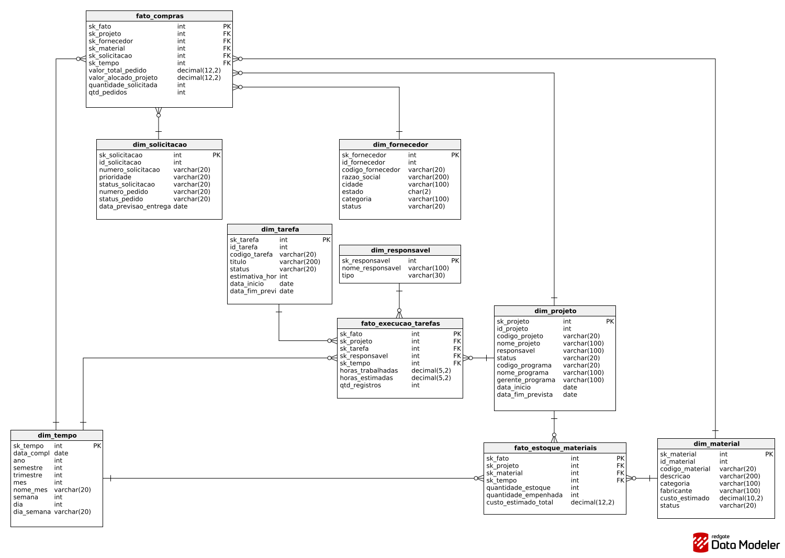
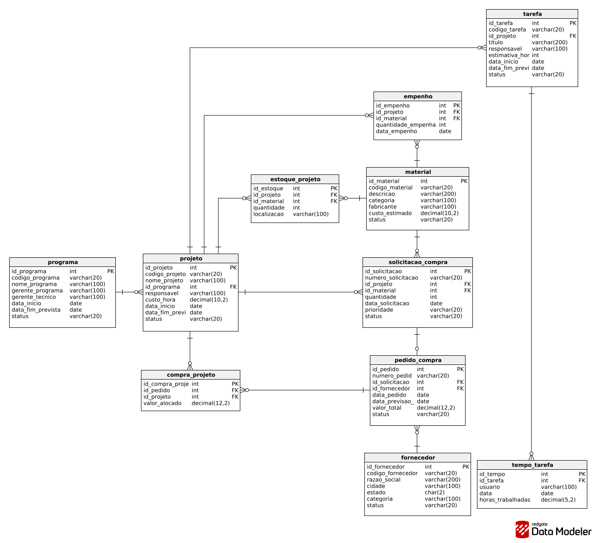

# 🚀 API 5º Semestre - 2026/1

🏢 **Empresa Parceira:** SIATT

🔗 **Repositórios:** [API-5SEM](https://github.com/DenariusData/API-5SEM) (principal) · [ETL](https://github.com/DenariusData/API-5SEM-ETL) · [Backend](https://github.com/DenariusData/API-5SEM-BACKEND) · [Frontend](https://github.com/DenariusData/API-5SEM-FRONTEND)

---

## 📌 Resumo do Projeto

> **Nexus** — plataforma analítica de integração e exploração de dados de projetos estratégicos — consolida em um Data Warehouse os dados de programas, projetos, tarefas, materiais, compras e estoque que antes estavam espalhados em planilhas e CSVs, e os apresenta em dashboards para apoiar a decisão dos gestores.

---

## ⚠️ Problema

> A SIATT gerencia projetos estratégicos que envolvem engenharia, compra de materiais, apontamento de horas e acompanhamento de programas. Os dados operacionais ficavam fragmentados em sistemas e registros diferentes, o que dificultava análises integradas e limitava a visibilidade sobre custo, consumo de materiais e andamento dos projetos.

---

## 💡 Solução

> Construção de um pipeline **ETL em Python (Polars)** que lê os CSVs de origem, valida e padroniza os dados e carrega um **Data Warehouse em PostgreSQL modelado em esquema estrela**; uma **API REST em Go** expõe os dados consolidados; e um **frontend em Nuxt 3** apresenta os dashboards analíticos. Tudo sobe com Docker Compose, com pipeline de CI e análise de qualidade no SonarCloud.

**Funcionalidades:**
- Integração de 11 fontes CSV em um banco unificado (OLTP + DW)
- Validação e tratamento de inconsistências antes da visualização
- Dashboards de custo por projeto, risco de atraso e custo x execução
- Investimento por programa, consumo de materiais por projeto e tempo gasto por tarefa/responsável
- Filtros analíticos, busca rápida e exportação (CSV/PDF)

---

## 🛠 Tecnologias Adotadas

**Python + Polars | PostgreSQL | Go | Nuxt 3 (Vue.js) + TypeScript | Chart.js | Vitest | GitHub Actions | SonarCloud | Docker**

- **Python + Polars**: pipeline ETL (extração dos CSVs, transformação em dimensões e fatos, carga).
- **PostgreSQL**: banco relacional (OLTP) e Data Warehouse em esquema estrela (schema `dw`).
- **Go**: API REST que expõe as dimensões e fatos para o frontend.
- **Nuxt 3 + Nuxt UI + TypeScript**: páginas e componentes dos dashboards.
- **Chart.js (vue-chartjs)**: gráficos dos dashboards.
- **Vitest**: testes unitários do frontend com relatório de cobertura.
- **GitHub Actions + SonarCloud**: integração contínua (lint, type-check, testes, build) e análise de qualidade.
- **Docker / Docker Compose**: execução de todos os serviços em containers.

---

## 👨‍💻 Contribuições Individuais

Atuei como **Dev Team** em três frentes: **modelagem e ETL do Data Warehouse**, **páginas analíticas do frontend** e **qualidade/CI** dos repositórios. Abaixo estão as entregas, cada uma com o código que escrevi e o link do commit correspondente.

### 🗂️ 1. Análise das fontes e modelagem do Data Warehouse

Antes de escrever código, analisei os 11 CSVs entregues pelo cliente (estrutura, chaves, relacionamentos e problemas de integridade) e documentei o resultado. A partir dessa análise desenhei o **modelo relacional** (OLTP) e o **modelo estrela** do DW, com 3 tabelas fato e 7 dimensões.

🔗 Commit: [`db49a13` — star schema modeling and initial ETL pipeline](https://github.com/DenariusData/API-5SEM-ETL/commit/db49a13c8cc3fbe676ec8916be0e3e9f1c46b430) · Documento: [csv_analysis.md](https://github.com/DenariusData/API-5SEM-ETL/blob/main/docs/csv_analysis.md)

<details>
<summary><b>Modelo estrela do Data Warehouse (3 fatos e 7 dimensões)</b></summary>
<br>



- **fato_compras**: valor total do pedido, valor alocado ao projeto, quantidade solicitada.
- **fato_execucao_tarefas**: horas trabalhadas x horas estimadas.
- **fato_estoque_materiais**: quantidade em estoque, quantidade empenhada e custo estimado.
- A **dim_tempo** é compartilhada pelos três fatos, o que permite cruzar compras, execução e estoque no mesmo período.

</details>

<details>
<summary><b>Modelo relacional (OLTP) de origem</b></summary>
<br>



</details>

### ⚙️ 2. Pipeline ETL inicial com Polars

Implementei a primeira versão do pipeline (extract → transform → load), com uma função `build_dim_*` para cada dimensão e uma `build_fato_*` para cada fato.

Duas decisões que tomei aqui:
- A `dim_tempo` é gerada a partir da **união das datas de todas as fontes** (compras, execução e estoque), para que nenhum fato fique sem data correspondente.
- Nos fatos, toda chave substituta que volta nula do `join` recebe `0` (**membro desconhecido**), evitando chave estrangeira nula, que quebraria as análises e as ferramentas de BI.

<details>
<summary><b>Código em Python — dimensão de tempo (dimensoes.py)</b></summary>

```python
def build_dim_tempo(df_datas: pl.DataFrame) -> pl.DataFrame:
    """
    Gera a dim_tempo a partir de um DataFrame com coluna 'data'.
    Deve receber o concat de TODAS as fontes que usam tempo
    (compras, execucao, estoque) para cobrir todas as datas do DW.
    Inclui: ano, semestre, trimestre, mes, nome_mes, semana, dia, dia_semana.
    """
    # lookup vetorial de mes → nome: substitui map_elements, muito mais rápido
    lookup_mes = pl.DataFrame({
        "mes_num": list(range(1, 13)),
        "nome_mes": [
            "Janeiro", "Fevereiro", "Março", "Abril", "Maio", "Junho",
            "Julho", "Agosto", "Setembro", "Outubro", "Novembro", "Dezembro",
        ],
    }).with_columns(pl.col("mes_num").cast(pl.Int32))

    df = (
        df_datas
        .select([pl.col("data").alias("data_completa")])
        .unique()
        .with_columns([
            pl.col("data_completa").str.strptime(pl.Date, "%Y-%m-%d"),
            pl.col("data_completa").dt.year().alias("ano"),
            pl.col("data_completa").dt.month().cast(pl.Int32).alias("mes"),
            pl.col("data_completa").dt.day().alias("dia"),
            pl.col("data_completa").dt.weekday().alias("dia_semana"),
            pl.col("data_completa").dt.week().alias("semana"),
        ])
        .with_columns([
            pl.when(pl.col("mes") <= 6).then(1).otherwise(2).alias("semestre"),
            pl.when(pl.col("mes") <= 3).then(1)
              .when(pl.col("mes") <= 6).then(2)
              .when(pl.col("mes") <= 9).then(3)
              .otherwise(4).alias("trimestre"),
        ])
        .join(lookup_mes, left_on="mes", right_on="mes_num", how="left")
        .with_row_index("sk_tempo")
    )
    return df
```

</details>

<details>
<summary><b>Código em Python — fato de compras com chaves substitutas (fatos.py)</b></summary>

```python
# sk=0 é a convenção "membro desconhecido" do DW —
# evita FK nula que quebraria análises e ferramentas de BI
_SK_DESCONHECIDO = 0


def build_fato_compras(
    df_compras: pl.DataFrame,
    dim_projeto: pl.DataFrame,
    dim_fornecedor: pl.DataFrame,
    dim_material: pl.DataFrame,
    dim_solicitacao: pl.DataFrame,
    dim_tempo: pl.DataFrame,
) -> pl.DataFrame:
    return (
        df_compras
        .join(dim_projeto,     on="id_projeto",     how="left")
        .join(dim_fornecedor,  on="id_fornecedor",  how="left")
        .join(dim_material,    on="id_material",    how="left")
        .join(dim_solicitacao, on="id_solicitacao", how="left")
        .join(dim_tempo,       left_on="data", right_on="data_completa", how="left")
        .select([
            "sk_projeto", "sk_fornecedor", "sk_material",
            "sk_solicitacao", "sk_tempo",
            "valor_total_pedido", "valor_alocado_projeto",
            "quantidade_solicitada", "qtd_pedidos",
        ])
        .with_columns([
            pl.col("sk_projeto").fill_null(_SK_DESCONHECIDO),
            pl.col("sk_fornecedor").fill_null(_SK_DESCONHECIDO),
            pl.col("sk_material").fill_null(_SK_DESCONHECIDO),
            pl.col("sk_solicitacao").fill_null(_SK_DESCONHECIDO),
            pl.col("sk_tempo").fill_null(_SK_DESCONHECIDO),
        ])
        .with_row_index("sk_fato")
    )
```

</details>

### 🔁 3. Carga incremental com upsert e tratamento de versões (v1/v2)

Na Sprint 3 o cliente enviou uma segunda leva de dados (v2). Alguns IDs da v2 repetiam IDs da v1 **com conteúdo diferente**, e a orientação da PO foi nunca substituir registros, sempre adicionar. Reescrevi a extração e a carga para tratar isso:

- **Extração acumulativa:** para cada tabela, comparo os registros com ID em comum entre v1 e v2. Se o conteúdo é idêntico, basta deduplicar; se é diferente, desloco todos os IDs da v2 (offset = maior ID da v1) e propago o mesmo deslocamento para as chaves estrangeiras que apontam para aquela tabela, preservando a integridade referencial.
- **Carga com upsert:** troquei o `DROP TABLE` + `COPY` direto por `CREATE TABLE IF NOT EXISTS` e uma carga via tabela temporária com `INSERT ... ON CONFLICT DO NOTHING`, para que o pipeline possa ser executado várias vezes sem apagar nem duplicar dados.

🔗 Commit: [`fb194bd` — incremental data loading with upsert and accumulative extract](https://github.com/DenariusData/API-5SEM-ETL/commit/fb194bd85e8246f44fea3833c841512aa2194870)

<details>
<summary><b>Código em Python — detecção de conflito de IDs entre versões (extract.py)</b></summary>

```python
def _calcular_offsets(pasta: str) -> dict[str, int]:
    """
    Para cada tabela, decide se a v2 precisa de offset nos IDs.

      1. Conteúdo IDÊNTICO → a v2 já contém os registros da v1.
         Basta fazer unique() depois do concat; offset = 0.

      2. Conteúdo DIFERENTE → o mesmo ID foi reutilizado para um
         registro novo. Conforme orientação da PO: nunca substituir,
         sempre adicionar com novo ID. Nesse caso offset = max(id_v1).
    """
    offsets: dict[str, int] = {}

    for nome_arquivo, info in _SCHEMA.items():
        v1_paths = glob.glob(f"{pasta}/v1/{nome_arquivo}")
        v2_paths = glob.glob(f"{pasta}/v2/{nome_arquivo}")

        if not v1_paths or not v2_paths:
            offsets[nome_arquivo] = 0
            continue

        df_v1 = pl.read_csv(v1_paths[0])
        df_v2 = pl.read_csv(v2_paths[0])

        ids_comuns = set(df_v1[info["pk"]].to_list()) & set(df_v2[info["pk"]].to_list())

        if not ids_comuns:
            offsets[nome_arquivo] = 0
            continue

        # Compara o conteúdo dos registros com IDs em comum
        v1_comuns = df_v1.filter(pl.col(info["pk"]).is_in(list(ids_comuns))).sort(info["pk"])
        v2_comuns = df_v2.filter(pl.col(info["pk"]).is_in(list(ids_comuns))).sort(info["pk"])

        ha_conflito = any(
            r1 != r2
            for r1, r2 in zip(v1_comuns.to_dicts(), v2_comuns.to_dicts())
        )

        offsets[nome_arquivo] = int(df_v1[info["pk"]].max()) if ha_conflito else 0

    return offsets


def _aplicar_offset(df: pl.DataFrame, nome_arquivo: str, offset: int,
                    offsets: dict[str, int]) -> pl.DataFrame:
    """
    Aplica offset na PK e em cada FK cujo arquivo referenciado também
    possui offset > 0, preservando a integridade referencial da v2.
    """
    if offset == 0:
        return df

    info = _SCHEMA[nome_arquivo]
    df = df.with_columns(pl.col(info["pk"]) + offset)

    for fk_col, ref_arquivo in info["fks"].items():
        ref_offset = offsets.get(ref_arquivo, 0)
        if ref_offset > 0 and fk_col in df.columns:
            df = df.with_columns(pl.col(fk_col) + ref_offset)

    return df
```

</details>

<details>
<summary><b>Código em Python + SQL — upsert no PostgreSQL via tabela temporária (load_db.py)</b></summary>

```python
def _upsert_df(cur, table: str, df: pl.DataFrame, pk: str) -> int:
    if df.is_empty():
        return 0

    buf = io.StringIO()
    df.write_csv(buf)
    buf.seek(0)

    tmp = f"_tmp_{table.replace('.', '_')}"
    cols = ", ".join(df.columns)
    col_defs = ", ".join(f"{c} TEXT" for c in df.columns)

    # 1. Carrega tudo em uma tabela temporária com COPY (rápido)
    cur.execute(f"CREATE TEMP TABLE {tmp} ({col_defs}) ON COMMIT DROP")

    with cur.copy(f"COPY {tmp} ({cols}) FROM STDIN WITH CSV HEADER") as copy:
        while chunk := buf.read(8192):
            copy.write(chunk)

    # 2. Converte os tipos (chaves, valores, datas e inteiros) no SELECT
    select_cols = ", ".join(
        (
            f"{c}::BIGINT"
            if c == pk or c.startswith("sk_") or c.startswith("id_")
            else f"{c}::DECIMAL"
            if ("valor" in c.lower() or "custo" in c.lower() or "horas" in c.lower())
            else f"{c}::DATE"
            if "data" in c.lower()
            else f"{c}::INT"
            if c in _COLUNAS_INTEIRAS
            else c
        )
        for c in df.columns
    )

    # 3. Insere só o que ainda não existe — nunca sobrescreve
    cur.execute(f"""
        INSERT INTO {table} ({cols})
        SELECT {select_cols}
        FROM {tmp}
        ON CONFLICT ({pk}) DO NOTHING
    """)

    cur.execute(f"SELECT COUNT(*) FROM {tmp}")
    row = cur.fetchone()
    return row[0] if row else 0
```

> No repositório a lista de colunas inteiras está escrita por extenso dentro da função; aqui ela aparece como `_COLUNAS_INTEIRAS` apenas para encurtar o trecho.

</details>

### 📊 4. Páginas analíticas do frontend (Nuxt 3)

Desenvolvi três páginas do dashboard, cada uma com cards de indicadores, gráfico e tabela, consumindo os endpoints da API em Go:

| Página | O que mostra | Commit |
|--------|--------------|--------|
| **Investimentos por Programa** | Ranking dos 3 programas com maior investimento e tabela de projetos por programa | [`7b8a831`](https://github.com/DenariusData/API-5SEM-FRONTEND/commit/7b8a831334fa71d418d22e0b7714f95fece370bd) · [`aed599b`](https://github.com/DenariusData/API-5SEM-FRONTEND/commit/aed599bd74a60ba2f9c08e93ad1655084ca9a9c5) |
| **Materiais por Projeto** | Material mais frequente, projetos com materiais, média de estoque, gráfico e tabela | [`fa26b23`](https://github.com/DenariusData/API-5SEM-FRONTEND/commit/fa26b23e1e880f74956717a69864f4ef2b3e188c) |
| **Produtividade** | Total de horas registradas, responsável mais produtivo, média por execução e top 10 de horas por responsável | [`61a4d6c`](https://github.com/DenariusData/API-5SEM-FRONTEND/commit/61a4d6c3a7598b2282ab3da4a6f8a4e9508b346e) |

<details>
<summary><b>Código em Vue/TypeScript — indicadores da página de Produtividade (produtividade.vue)</b></summary>

```vue
<script setup lang="ts">
import type { FatoExecucao, TempoGasto } from '~/types/api'

definePageMeta({
  layout: 'dashboard'
})

const { data: execucoes, status } = await useApi<FatoExecucao[]>('/api/fato/execucao-tarefas')
const { data: tempoGasto } = await useApi<TempoGasto>('/api/dim/tempo-gasto')

const loading = computed(() => status.value === 'pending')

const responsavelMaisProdutivo = computed(() => {
  if (!execucoes.value?.length) return '-'
  const map = new Map<string, number>()
  for (const e of execucoes.value) {
    map.set(e.sk_responsavel, (map.get(e.sk_responsavel) ?? 0) + Number(e.horas_trabalhadas))
  }
  return [...map.entries()].sort((a, b) => b[1] - a[1])[0]?.[0] ?? '-'
})

const mediaPorExecucao = computed(() => {
  if (!execucoes.value?.length) return 0
  const total = execucoes.value.reduce((acc, e) => acc + Number(e.horas_trabalhadas), 0)
  return (total / execucoes.value.length).toFixed(1)
})

const stats = computed(() => [
  {
    label: 'Total de horas registradas',
    value: `${tempoGasto.value?.total_tempo_gasto.toFixed(1) ?? 0}h`,
    icon: 'i-lucide-clock'
  },
  {
    label: 'Responsável mais produtivo',
    value: responsavelMaisProdutivo.value,
    icon: 'i-lucide-user-check'
  },
  {
    label: 'Média de horas por execução',
    value: `${mediaPorExecucao.value}h`,
    icon: 'i-lucide-bar-chart-2'
  }
])
</script>
```

</details>

<details>
<summary><b>Código em Vue/TypeScript — gráfico de horas por responsável, top 10 (BarChart.vue)</b></summary>

```vue
<script setup lang="ts">
import { Bar } from 'vue-chartjs'
import { useChartColors } from '~/composables/useChartColors'
import type { FatoExecucao } from '~/types/api'

const props = defineProps<{
  execucoes: FatoExecucao[]
}>()

const { textColor, gridColor } = useChartColors()

// Agrupa as horas por responsável, ordena e mantém os 10 maiores
const agrupado = computed(() => {
  const map = new Map<string, number>()
  for (const e of props.execucoes) {
    const total = (map.get(e.sk_responsavel) ?? 0) + Number(e.horas_trabalhadas)
    map.set(e.sk_responsavel, total)
  }
  return [...map.entries()]
    .sort((a, b) => b[1] - a[1])
    .slice(0, 10)
    .map(([nome, total]) => ({ nome, total: Number(total.toFixed(1)) }))
})

const chartData = computed(() => ({
  labels: agrupado.value.map(({ nome }) => nome),
  datasets: [
    {
      label: 'Horas trabalhadas',
      data: agrupado.value.map(({ total }) => total),
      backgroundColor: '#EA3837',
      borderRadius: 6
    }
  ]
}))
</script>

<template>
  <div class="h-80 w-full">
    <Bar :data="chartData" :options="options" />
  </div>
</template>
```

</details>

<!-- TODO (Tiago): adicionar aqui prints ou GIFs das três páginas rodando.
     Salve as imagens em projetos/evidencias/5-semestre/ e use, por exemplo:

<details>
<summary><b>Tela — Produtividade</b></summary>
<br>


</details>
-->

### ✅ 5. Testes unitários, CI e SonarCloud

Para garantir qualidade nas entregas do time, configurei a integração contínua dos repositórios de **frontend** e **backend** e escrevi os testes unitários das páginas e componentes que desenvolvi.

- **Testes (Vitest):** 12 arquivos de teste cobrindo home, investimentos, materiais e produtividade, no padrão *Arrange / Act / Assert* — [`82f995c`](https://github.com/DenariusData/API-5SEM-FRONTEND/commit/82f995c80126625111a1302c44beebc6fe12a5da)
- **CI do frontend (GitHub Actions):** evoluí o workflow básico que existia (lint e type-check em sequência) para jobs paralelos de lint, type-check e testes com cobertura; o build só roda se os três passarem — [`bea27a2`](https://github.com/DenariusData/API-5SEM-FRONTEND/commit/bea27a29fae06d567e2a515871d066e1738e0132)
- **SonarCloud:** análise de qualidade em workflow separado, recebendo o relatório de cobertura (lcov) — [`5d155f4`](https://github.com/DenariusData/API-5SEM-FRONTEND/commit/5d155f42e840a5338f4ad7e65051e08668e6bc60)
- **CI do backend (Go):** `go vet`, testes com cobertura, build e SonarCloud — [`143b874`](https://github.com/DenariusData/API-5SEM-BACKEND/commit/143b874a2117ece4a8ca0bd421cc6868805f4e45)

<details>
<summary><b>Código em TypeScript — teste unitário do agrupamento de horas (ProductivityBarChart.spec.ts)</b></summary>

```typescript
describe('ProductivityBarChart', () => {
  it('agrupa horas corretamente por responsável', () => {
    // Arrange + Act
    const result = agruparHorasPorResponsavel(mockExecucoes)

    // Assert
    const ana = result.find(r => r.nome === 'Ana')
    expect(ana?.total ?? 0).toBe(12)
  })

  it('ordena por maior total de horas primeiro', () => {
    const result = agruparHorasPorResponsavel(mockExecucoes)

    expect(result[0]?.nome).toBe('Ana')
    expect(result[1]?.nome).toBe('Bruno')
    expect(result[2]?.nome).toBe('Carla')
  })

  it('limita ao top 10 responsáveis', () => {
    // Arrange
    const muitos: FatoExecucao[] = Array.from({ length: 15 }, (_, i) => ({
      sk_fato: String(i),
      sk_projeto: 'P1',
      sk_tarefa: 'T1',
      sk_responsavel: `Responsavel ${i}`,
      sk_tempo: '2025-01-01',
      horas_trabalhadas: String(i + 1)
    }))

    // Act
    const result = agruparHorasPorResponsavel(muitos)

    // Assert
    expect(result.length).toBeLessThanOrEqual(10)
  })

  it('arredonda total para 1 casa decimal', () => {
    const execucoes: FatoExecucao[] = [
      { sk_fato: '1', sk_projeto: 'P1', sk_tarefa: 'T1', sk_responsavel: 'Ana', sk_tempo: '2025-01-01', horas_trabalhadas: '1.333' },
      { sk_fato: '2', sk_projeto: 'P1', sk_tarefa: 'T2', sk_responsavel: 'Ana', sk_tempo: '2025-01-02', horas_trabalhadas: '1.333' }
    ]

    const result = agruparHorasPorResponsavel(execucoes)

    expect(result[0]?.total).toBe(2.7)
  })
})
```

</details>

<details>
<summary><b>Workflow do GitHub Actions — CI do frontend (ci.yml, resumido)</b></summary>

```yaml
name: CI Frontend

on:
  push:
    branches: [main, Sprint-3]
  pull_request:
    branches: [main, Sprint-3]

# cancela execuções antigas do mesmo branch quando chega um commit novo
concurrency:
  group: ci-${{ github.ref }}
  cancel-in-progress: true

jobs:
  lint:
    name: Lint (ESLint)
    runs-on: ubuntu-latest
    steps:
      - uses: actions/checkout@de0fac2e4500dabe0009e67214ff5f5447ce83dd # v6.0.2
      - name: Install pnpm
        uses: pnpm/action-setup@fc06bc1257f339d1d5d8b3a19a8cae5388b55320 # v4.4.0
      - name: Set up Node
        uses: actions/setup-node@49933ea5288caeca8642d1e84afbd3f7d6820020 # v4.4.0
        with:
          node-version-file: '.nvmrc'
          cache: 'pnpm'
      - run: pnpm install --frozen-lockfile
      - run: pnpm lint

  typecheck:
    name: TypeScript type-check
    # ... mesmo setup ...
      - run: pnpm typecheck

  test:
    name: Tests + Coverage (Vitest)
    # ... mesmo setup ...
      - run: pnpm vitest run --coverage
      - name: Upload coverage report
        uses: actions/upload-artifact@4cec3d8aa04e39d1a68397de0c4cd6fb9dce8ec1 # v4.6.1
        with:
          name: coverage-report-frontend
          path: coverage/
          retention-days: 7

  build:
    name: Build (Nuxt)
    needs: [lint, typecheck, test]   # só builda se tudo passar
    # ... mesmo setup ...
      - run: pnpm build
```

</details>

---

## 📚 Aprendizados Efetivos

Este foi o projeto mais próximo da área em que quero atuar (dados). Pela primeira vez percorri o caminho completo: entender dados brutos do cliente, modelar um Data Warehouse, construir o ETL e chegar até o dashboard que o gestor usa. Também foi meu primeiro contato com integração contínua e análise de qualidade de código.

### 🧠 Hard Skills

> **Escala (Taxonomia de Bloom adaptada):** ★☆☆☆ Ouvi falar (lembrar) → ★★☆☆ Entendi → ★★★☆ Sei fazer com ajuda (aplicar) → ★★★★ Sei fazer com autonomia (aplicar)

| Tecnologia / Método | Nível | Classificação | Onde apliquei |
|---------------------|:-----:|---------------|---------------|
| Modelagem dimensional (esquema estrela) | ★★★★ | Sei fazer com autonomia | Desenho das 3 fatos e 7 dimensões do DW |
| Análise e qualidade de dados | ★★★★ | Sei fazer com autonomia | Análise dos 11 CSVs e tratamento do conflito de IDs v1/v2 |
| Python + Polars (ETL) | ★★★☆ | Sei fazer com ajuda | Pipeline de extração, transformação e carga |
| PostgreSQL (DDL, COPY, upsert) | ★★★☆ | Sei fazer com ajuda | Carga incremental com `ON CONFLICT DO NOTHING` |
| Nuxt 3 / Vue.js + TypeScript | ★★★★ | Sei fazer com autonomia | Páginas de investimentos, materiais e produtividade |
| Chart.js (vue-chartjs) | ★★★★ | Sei fazer com autonomia | Gráficos de barras dos dashboards |
| Testes unitários (Vitest) | ★★★☆ | Sei fazer com ajuda | 12 arquivos de teste das páginas e componentes |
| GitHub Actions (CI) | ★★★☆ | Sei fazer com ajuda | Pipelines de lint, type-check, testes e build |
| SonarCloud | ★★★☆ | Sei fazer com ajuda | Análise de qualidade e cobertura no frontend e backend |
| Docker / Docker Compose | ★★★☆ | Sei fazer com ajuda | Execução local dos serviços do projeto |
| Go | ★★☆☆ | Entendi | Li a API para consumir os endpoints e configurei o CI (`go vet`, `go test`) |
| Grafana / Prometheus / Loki | ★☆☆☆ | Ouvi falar | Monitoramento configurado por outros membros do time |

### 🤝 Soft Skills

| Competência | Situação no projeto | O que fiz |
|-------------|---------------------|-----------|
| Comunicação | Na segunda leva de dados (v2), IDs se repetiam com conteúdo diferente e não estava claro qual versão deveria valer | Alinhei a regra com a PO ("nunca substituir, sempre adicionar"), implementei conforme o combinado e deixei a decisão documentada no próprio código |
| Pensamento analítico | O cliente entregou 11 CSVs sem documentação | Analisei estrutura, chaves e inconsistências de cada arquivo e registrei tudo em um documento que serviu de base para a modelagem do time |
| Proatividade | O frontend só tinha um CI básico (lint e type-check) e o backend não tinha pipeline; nenhum dos dois rodava testes ou media cobertura | Assumi a configuração do CI com testes, cobertura e SonarCloud nos dois repositórios |
| Organização | Atuei em três repositórios (ETL, frontend e backend) ao longo das sprints | Trabalhei com uma branch e um pull request por entrega, seguindo o padrão de commits do time |
| Trabalho em equipe | As páginas do frontend dependiam dos endpoints do backend em Go | Combinei os contratos de dados com quem desenvolvia a API e tipei as respostas no frontend (`types/api.ts`) |

---

## 🔎 Navegação entre Projetos

- [1º Semestre: Calculadora Científica](API-1-semestre.md)
- [2º Semestre: PACER+ — Avaliador de Competências](API-2-semestre.md)
- [3º Semestre: Altime — Controle de Ponto e Gestão de Funcionários](API-3-semestre.md)
- [4º Semestre: Radarius — Monitoramento e Alerta de Tráfego](API-4-semestre.md)
- **5º Semestre:** Nexus — Plataforma Analítica de Dados de Projetos

[⬅️ Voltar ao Portfólio](../README.md)
